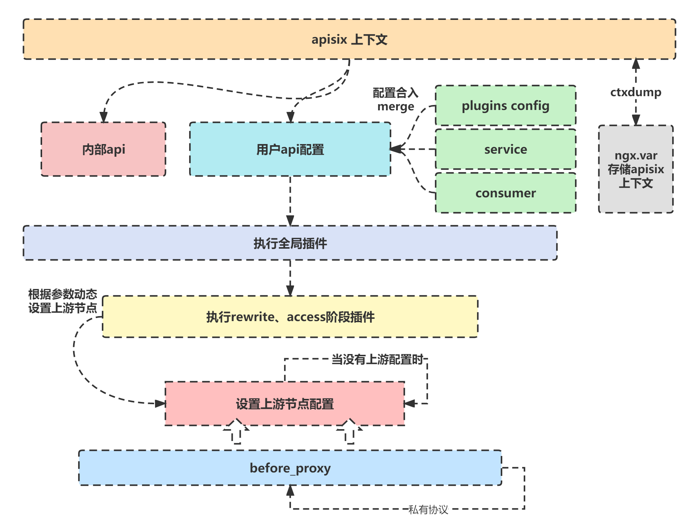
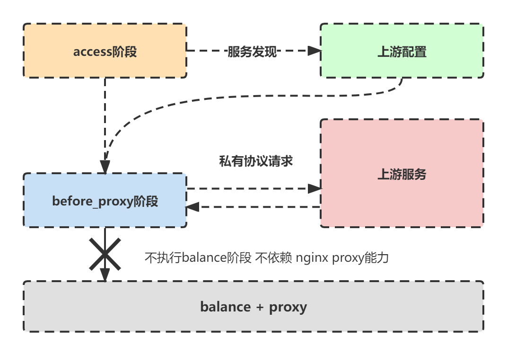

上篇文章我们介绍了apisix启动时对http模块做的初始化工作。这篇文章介绍apisix在access阶段的处理流程。


> 基本流程
> 1. 初始化上下文
> 2. 尝试匹配内部路由，匹配到则执行并退出该阶段
> 3. 匹配用户配置路由，匹配不到则执行全局插件后退出该流程，返回404
> 4. 读取并合入plugin config配置
> 5. 读取并合入service配置
> 6. 执行全局插件
> 7.1 如果有script则执行script，跳过第七步
> 7.2 执行路由插件rewrite阶段
> 7.3 如果有consumer，则合入consumer的插件
> 7.4 执行路由插件access阶段
> 8. 读取合入upstream配置
> 9. 读取upstream节点信息（服务发现）
> 10. 调用before_proxy阶段插件
> 11. 编码存储上下文
> 12. 若请求时grpc或dubbo则转发流程



下面我们根据上述步骤逐一详细阅读

## 上下文

apisix自己维护一个上下文，存放在`ngx.ctx.api_ctx`中。匹配到的路由、上游等信息均存放在这里，同时插件函数的入参ctx指的也是api_ctx，而不是nginx.ctx。

apisix会在access阶段结束时**打包ngx.ctx并存储在var中**，以便当**内部重定向时**到了header_filter、log阶段，可以通过var中打包的上下文重新载入父请求的ctx。
> 每个请求（包括子请求）都会维护自己的一个ctx，所以当重定向时ngx.ctx是个新的表。

```lua
-- 打包
-- apisix/init.lua line.537
local ref = ctxdump.stash_ngx_ctx()
ngx_var.ctx_ref = ref
-- 解包
-- apisix/init.lua line.552
-- apisix/init.lua line.591
local stash_ctx = ctxdump.apply_ngx_ctx(ref)
ngx.ctx = stash_ctx
```

## tablepool

单个请求中的请求上下文、插件等信息都使用table存储。但对于lua而言，table是一个复杂对象，创建和销毁需要大量资源。

openresty提供了tablepool能力防止频繁创建table，apisix在贯穿一个http请求时大多数上下文变量均使用的tablepool创建。

```lua
-- apisix/init.lua line.354
-- 从table池子取出hash键有32个的table
local api_ctx = core.tablepool.fetch("api_ctx", 0, 32)
-- 单独维护一个上下文
ngx_ctx.api_ctx = api_ctx
```

## api_ctx.var

apisix除了维护自己的上下文以外，还维护了var变量，不同于nginx的var。apisix的var同时支持直接索引url参数、cookie参数、header参数、graphql参数、post参数。

值得一提的是，截至2.12.1版本，post参数指的是form-data传递的参数，暂不支持json格式参数。

```lua
-- url参数
local xxx = api_ctx.var.arg_xxx
-- cookie参数
local xxx = api_ctx.var.cookie_xxx
-- post参数
local xxx = api_ctx.var.post_arg_xxx
-- header
local xxx = api_ctx.var.http_xxx
-- graphql_
local xxx = api_ctx.var.graphql_xxx
```

# 路由匹配

## 内部路由

apisix有两种内部路由
- 以/apisix为前缀的路由，多用于admin接口
- 插件配置的内置接口

**我们主要讨论第二种接口**

### 插件内置接口

apisix允许插件本身注册路由，被插件注册的路由将视为内部接口

**被匹配到的内部接口仅执行插件注入的逻辑，不尝试匹配用户配置的路由规则**

apisix通过`has_route_not_under_apisix`方法判断是否有插件注册了路由，该方法在第一次调用返回`true`，目的是促使apisix认为存在内部调用方法并尝试调用match方法匹配

```lua
-- apisix/api_router.lua lint.150
function _M.has_route_not_under_apisix()
    if has_route_not_under_apisix == nil then
        return true
    end

    return has_route_not_under_apisix
end
```

内部插件路由信息在第一次请求match的时候被初始化（这也是为什么第一次调用`has_route_not_under_apisix`直接返回true的原因）

match函数在第一次调用时会初始化存储所有注册了api方法（即内部路由）的插件。

当匹配到路由插件时，apisix根据`global_rule_skip_internal_api`参数判断执行全局插件，而后执行路由handler并结束当前阶段


```lua
-- apisix/init.lua line.376
-- 存在内部路径或者/apisix/前缀，
-- apisix将/apisix前缀的路径也认为是内部api
if router.api.has_route_not_under_apisix() or
    core.string.has_prefix(uri, "/apisix/")
then
    -- 插件路由函数是否执行全局插件
    local skip = local_conf and local_conf.apisix.global_rule_skip_internal_api
    local matched = router.api.match(api_ctx, skip)
    if matched then
        return
    end
end
```

## 用户配置路由

当匹配不到内部路由时，apisix开始匹配**用户配置的路由**。倘若匹配成功则注入匹配的路由基础信息。失败则执行全局插件逻辑并返回404结束流程。

```lua
-- apisix/http/route.lua line.83
-- dispatch成功调用函数，将匹配路由信息写入上下文
handler = function (api_ctx, match_opts)
   api_ctx.matched_params = nil
   api_ctx.matched_route = route
   api_ctx.curr_req_matched = match_opts.matched
end

-- apisix/init.lua line.389
-- 匹配失败时
if not route then
    -- run global rule
    plugin.run_global_rules(api_ctx, router.global_rules, nil)

    core.log.info("not find any matched route")
    return core.response.exit(404,
                {error_msg = "404 Route Not Found"})
end
```

# 配置聚合

匹配到路由之后开始将相关的配置进行聚合。

apisix抽象了许多概念，有上游（upstream）、消费者（consumer）、服务（service）、插件配置（plugins_config）、路由（route）等。

其中有许多配置是重复的，例如在路由中可以配置上游信息，也可以在服务中配置上游，还可以直接在route配置上游id，那么势必存在优先级的排序。

这里整理下各项配置的优先级

|配置|优先级|
|-|-|
|上游|**上下文上游配置** > 路由上游id > 服务上游id > 路由上游配置 > 服务上游配置|
|插件|路由插件配置集合(plugins_config) > 路由插件配置 (plugins)|

# apisix的access阶段

完成配置聚合之后，apisix在access阶段的改造开始显露出来。

首先执行全局插件。 而后判断是否存在脚本（script），脚本和插件（plugins）是冲突的，如果有脚本，则仅执行脚本逻辑，否则执行插件逻辑。

**注意，全局插件并不被脚本影响，无论有没有脚本均会执行全局插件**

看到这里，不知道有没有人注意到，在 [配置聚合](#配置聚合) 那一节我们提到了`上下文上游配置`。

原本这个配置应该是在**确定好上游配置之后**，通过服务发现得到了节点信息之后才有的配置。也就是说这是一个结果数据，不应该将他和配置数据一同进行优先级排序

**这里不得不提起apisix在长时间迭代下所产生的一个设计**

原本根据openresty的设计，access阶段应该更多的做鉴权一类的工作，而不应该将上游节点获取、服务发现这类事情放在access阶段。

在之前的版本apisix也是这样做的。但随着实际使用发现，许多时候我们在access阶段时就需要知道上游信息，或者我们**需要去更改原先设置的上游ip。**

例如灰度发布，我们在access阶段**动态根据header、url参数设置不同的上游**。亦或者我们在access阶段**直接通过私有协议完成请求工作**，不依赖apisix的balance和请求


此时传统的access阶段定义不能满足上述需求


基于以上需求，apisix**不再在balance阶段获取上游节点**，而是在access阶段，**执行插件之后**获取上游节点信息。

此时如果插件逻辑已设置好上游配置则不覆盖原有配置，这里就解决了动态配置上游的需求，apisix的[灰度插件](https://github.com/apache/apisix/blob/master/apisix/plugins/traffic-split.lua)就是通过这种方法实现。

此外，确定好上游配置后，apisix新增了`before_proxy`阶段（实际上还是在openresty的access阶段中执行）。

执行在`before_proxy`阶段的插件已经获取了上游节点，便于做私有协议请求，极大便利的业务拓展开发。

**before_proxy阶段作用不限于此，仅提出相较于其他节点优势所在**


